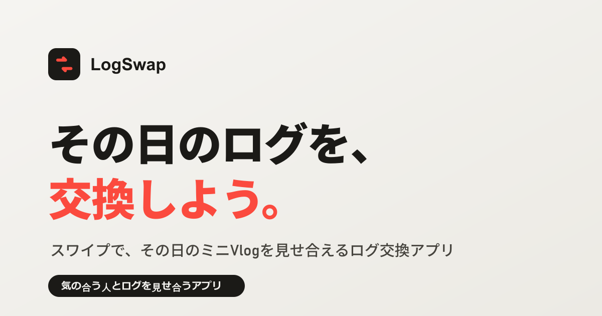

# LogSwap｜ログ交換アプリ（デモ）

「ログ（その日の断片的な日常ログ）」を交換する相手を見つける、Tinder 風スワイプ UI のランディング兼デモです。ヒーロー内の実機フレームで、実際にスワイプを試せます。全画面で操作したいときは「アプリを開く」（`app.html`）へ。

**デモ:** https://tmk4men.github.io/logswap/
**リポジトリ:** https://github.com/tmk4men/logswap



## これは何

- 画面に他のユーザーの **きょうのログ** が1枚ずつ表示されます
- **右スワイプ / 交換したい** … ログを交換したい
- **左スワイプ / 見送る** … 今回は見送る
- おたがいが交換を選ぶと **交換成立**（成立の演出が表示されます）

> [!NOTE]
> このアプリは **ログを交換するためのツール** です。マッチングアプリ・出会い目的のサービスではありません。
> 性別・年齢でのフィルタリングなど、異性紹介に該当しうる機能は意図的に持たせていません。

## 使い方

| 操作 | 内容 |
| --- | --- |
| カードを右へドラッグ / 交換したい / → キー | ログを交換したい |
| カードを左へドラッグ / 見送る / ← キー | 見送る |
| 詳しく ボタン | そのユーザーのログを詳しく見る |

## ローカルで動かす

ビルド不要・依存パッケージなしの静的サイトです。

```bash
python -m http.server 8000   # または npx serve .
```

ブラウザで `http://localhost:8000` を開きます。

## デザインの方針

AI っぽいテンプレート感（紫グラデ・近黒×蛍光・新聞調レイアウト）を避け、次の方針で作っています。

- **配色:** かなり薄い紫（ラベンダー）の地 + 寒色インク + コーラル単色アクセント
- **タイポ:** Zen Kaku Gothic New（日本語）+ Space Grotesk（欧文ロゴ・数字）
- **画像:** カードに実写を差し込み、写真を主役に。UI の記号はモノクロ SVG アイコンで統一
- **モーション:** スクロール出現は IntersectionObserver、`prefers-reduced-motion` に対応
- **配慮:** レスポンシブ（PC / モバイル）、キーボード操作、フォーカス可視化、OGP 設定

## 技術構成

- 素の **HTML / CSS / JavaScript** のみ。ビルド・依存なし
- バックエンドなし。ユーザーは `js/data.js` のモックデータ
- マッチングは擬似的（`likesBack: true` のユーザーに交換を出すと成立）
- スワイプは Pointer Events で実装
- 画像は picsum.photos から **webp** で配信（リポジトリを軽く保つため外部参照）

```
.
├── index.html        # ランディング + ヒーロー内デモ
├── app.html          # アプリ単体画面（全画面でスワイプ）
├── css/style.css     # スタイル
├── js/
│   ├── data.js       # モックユーザー & ログ
│   └── app.js        # スワイプ / マッチ / 表示ロジック
└── assets/
    ├── og.png        # OGP 画像 (1200x630)
    ├── og.svg        # OGP 画像のソース
    └── favicon.svg
```

## Android アプリ化（Capacitor）

Web の中身をそのまま包む形で、Android ネイティブアプリ（`com.tmk4men.logswap`）をビルドできます。
GitHub Pages 用のルート構成（`index.html` = ランディング）はそのまま、配信用の `www/` を生成して使います。

- `www/index.html` … スワイプ画面（`app.html` 由来。アプリ起動時はここに直行）
- `www/landing.html` … 紹介ページ（`index.html` 由来）

```bash
npm install                 # 初回のみ
npm run sync                # www/ を生成して android へ同期（build:www + cap sync）
npm run android             # Android Studio で開く
```

コマンドラインから直接ビルドする場合（Android Studio 同梱の JDK / SDK を利用）:

```bash
# JAVA_HOME=<Android Studio>/jbr, ANDROID_HOME=<SDK> を設定のうえ
cd android && ./gradlew assembleDebug
# → android/app/build/outputs/apk/debug/app-debug.apk
```

> [!NOTE]
> プロジェクトパスに日本語が含まれるため `android/gradle.properties` に `android.overridePathCheck=true` を設定しています。
> 純粋な Web ラッパー（NDK 不使用）のため現状ビルドできていますが、将来トラブルが出たら ASCII のみのパスへ移動してください。

広告（AdMob）の組み込みは次フェーズで `@capacitor-community/admob` を追加予定です。

## このデモから本番にするには

- `js/data.js` のモックを API 取得に置き換え
- 相互交換の判定をサーバー側のマッチングに置き換え（双方が交換で成立）
- ログ本体（動画など）の保存・配信基盤を追加

## ライセンス

[MIT](./LICENSE)
